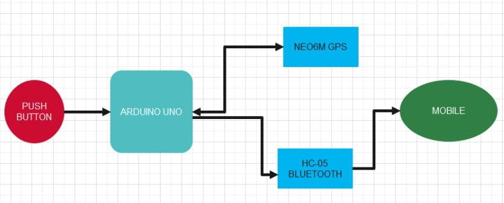
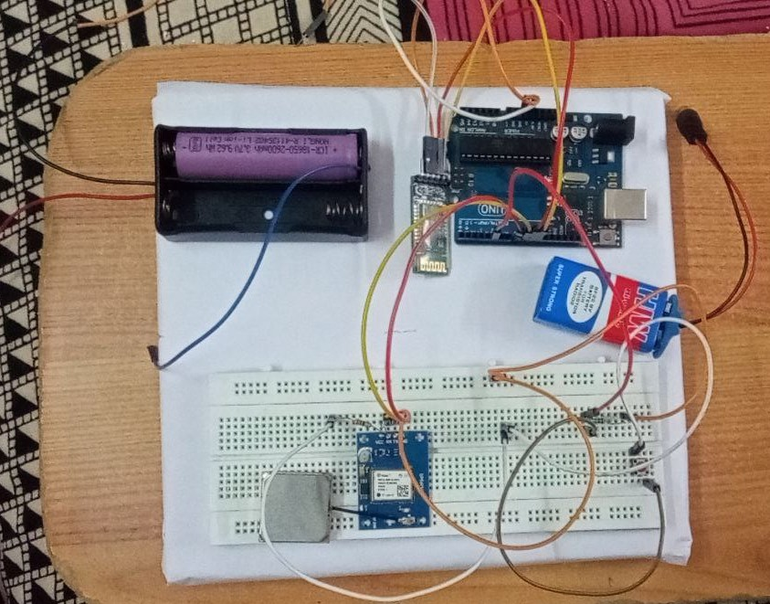

# Emergency-Alert-System
# 🆘 Emergency Alert System

An IoT-based safety device designed to help users in distress by sending their real-time location to emergency contacts and authorities via Bluetooth and GPS technology — all triggered by a single push button.

---

## 📌 Overview

In today’s world, personal safety is a growing concern, especially in remote and high-risk areas. This **Emergency Alert System** addresses the problem by enabling quick and reliable communication in emergency situations using **Arduino UNO**, **GPS (NEO-6M)**, and **Bluetooth (HC-05)** modules. With a simple press of a button, the system shares the user’s live location to predefined contacts, offering a life-saving solution.

---

## 🎯 Objectives

- Provide a reliable and real-time emergency alert mechanism
- Enable GPS-based live location tracking
- Send location info to relatives or emergency services using Bluetooth
- Create a portable and user-friendly safety gadget

---

## 🛠️ Hardware Components

| Component              | Description                                    |
|------------------------|------------------------------------------------|
| Arduino UNO            | Microcontroller to control the system         |
| NEO-6M GPS Module      | Tracks the user's real-time location          |
| HC-05 Bluetooth Module | Sends alert messages to mobile devices        |
| Push Button            | Triggers the emergency alert                  |
| Lithium-Ion Battery    | Portable power supply                         |
| Breadboard & Jumpers   | For prototyping and connecting components     |

📄 Full list available in [`components_list`](components_list)

---

## 🔧 How It Works

1. User presses the **emergency push button**
2. Arduino receives the signal and activates:
   - GPS module: captures **live coordinates**
   - Bluetooth module: sends **alert message** with location
3. Pre-configured mobile (connected via Bluetooth) receives the **location data**
4. Alert can reach:
   - Relatives
   - Local police stations
   - Emergency responders

---

## 🔄 Block Diagram

---

## 🖥️ Circuit / Schematic

---

## 💡 Use Cases

- Women’s safety devices
- Hikers or travelers in remote areas
- Elderly care and health monitoring
- Disaster-prone regions

---

## 📷 Working Prototype

---

## 🧠 Technology Used

- **Arduino C/C++** (Arduino IDE)
- **IOT / Embedded Systems**
- GPS communication via NMEA protocol
- Bluetooth serial communication

